# Toy RL Reasoning Post-Training
## Introduction
The primary objective of this project is to reproduce and learn from ProRL (https://arxiv.org/pdf/2505.24864), which enhances the reasoning capabilities of Large Language Models (LLMs) using Reinforcement Learning (RL).

The main training framework adopted is verl (https://github.com/volcengine/verl).

Due to hardware constraints (a single NVIDIA 4090 GPU), this project utilizes the Qwen/Qwen2-0.5B model. 

Furthermore, instead of training the full model parameters, we employ Low-Rank Adaptation (LoRA). During each "hard reset" mentioned in the ProRL paper, the LoRA parameters are merged into the base model. Following this, a new LoRA adapter and a new optimizer are re-initialized. 
## Training Detail

### Findings from Initial Tests
- Dataset & Validation: For smaller models, achieving reward improvement on overly difficult datasets proved challenging. Therefore, this project uses the openai/gsm8k (train subset) for training. For validation during the training process, the first 100 samples from the openai/gsm8k test subset are used. This is due to hardware limitations, as a larger validation set would significantly prolong the process.

- Initial Model Selection: The Qwen/Qwen2-0.5B-Instruct model struggled to show an increase in reward corresponding with training time. This is potentially due to a lack of diversity in its training data, insufficient rollout data, or a general lack of response diversity after instruction tuning. Consequently, we opted for the base Qwen/Qwen2-0.5B model, which provides greater response diversity while still being able to answer a portion of the questions correctly.

- Cold Start Problem: Directly applying the parameter settings (temperature, top_p) from the ProRL paper to Qwen/Qwen2-0.5B for RL-based reasoning training resulted in a severe cold start problem, making it difficult for the reward to increase over time. To address this, a smaller top_p value is used during the training phases preceding the initial hard resets.

### Parameter Settings
#### Training
 - LR: 2e-6
 - mini_batch_size: 32
 - ppo_micro_batch_size_per_gpu: 16
 - max_prompt_length: 512
 - kl_coef: 0.001
 - data.batch_size (number of questions in each rollout): 2
##### Initial
 - max_generation_token : 4096
 - rollout_n : 16
 - temperature : 1
 - top_p : 0.7
 - LoRA rank : 32
 - LoRA target_modules: [q_proj, k_proj]

##### Reset 1
 - max_generation_token : 4096
 - rollout_n : 16
 - temperature : 1
 - top_p : 0.9
 - LoRA rank : 32
 - LoRA target_modules: [q_proj, k_proj]

##### Reset 2
 - max_generation_token : 4096
 - rollout_n : 16
 - temperature : 1
 - top_p : 1
 - LoRA rank : 32
 - LoRA target_modules: [q_proj, k_proj]

##### Reset 3
 - max_generation_token : 4096
 - rollout_n : 16
 - temperature : 1.2
 - top_p : 1
 - LoRA rank : 32
 - LoRA target_modules: [q_proj, k_proj]
##### Reset 4
 - max_generation_token : 6144
 - overlong_buffer : 4096
 - rollout_n : 32
 - temperature : 1.2
 - top_p : 1
 - LoRA rank : 64
 - LoRA target_modules: [q_proj, k_proj, v_proj, "o_proj" ,"gate_proj" ,"up_proj" ,"down_proj"]

#### Validation
 - Temperature : 1
 - top_p : 0.7

Validation
Temperature: 1

top_p: 0.7

### Data Processing
- The model is expected to output answers in the format \box{answer}.
- There is no specific reward for correct formatting.
-  While the answers in the GSM8K dataset are integers, the model might produce floating-point-like outputs (e.g., 7.0).To handle this, the evaluation script extracts all digits (0-9), the decimal point (.), and the negative sign (-) from within the \box{} tags. Both the extracted string and the ground-truth answer are then converted to floats for comparison.
-   If the answer is correct, the reward is +1; otherwise, the reward is -1.

### Training Log and Hard Rest Timing
Each color represents the start of a different hard reset phase. When the validation performance was observed to decline or stagnate, we manually intervened in the experiment by merging the LoRA weights and initiating a reset. The experiment was concluded after the fifth reset because it was determined that the dataset could no longer provide significant room for further improvement for the model.
<table>
  <tr>
    <td align="center">
      <figure>
        <figcaption>Validation Reward</figcaption>
        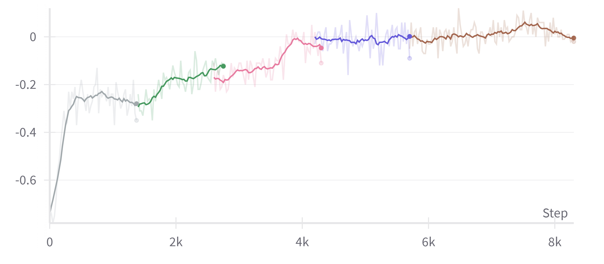
      </figure>
    </td>
    <td align="center">
      <figure>
      <figcaption>Train Reward</figcaption>
        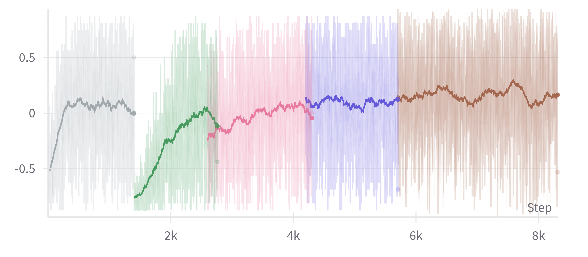
      </figure>
    </td>
  </tr>
  <tr>
    <td align="center">
      <figure>
        <figcaption>Train KL Loss</figcaption>
        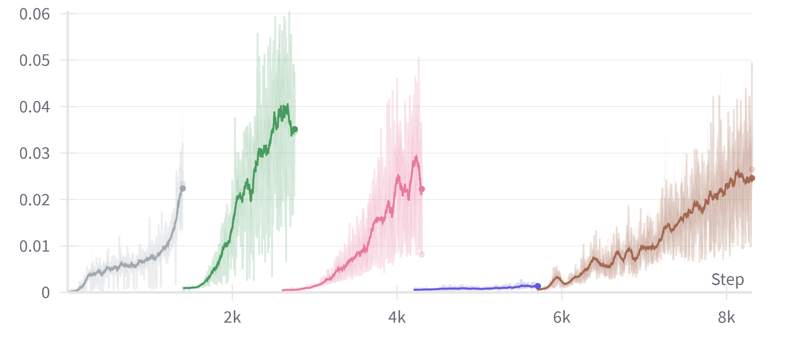
      </figure>
    </td>
    <td align="center">
      <figure>
        <figcaption>Train Entropy</figcaption>
        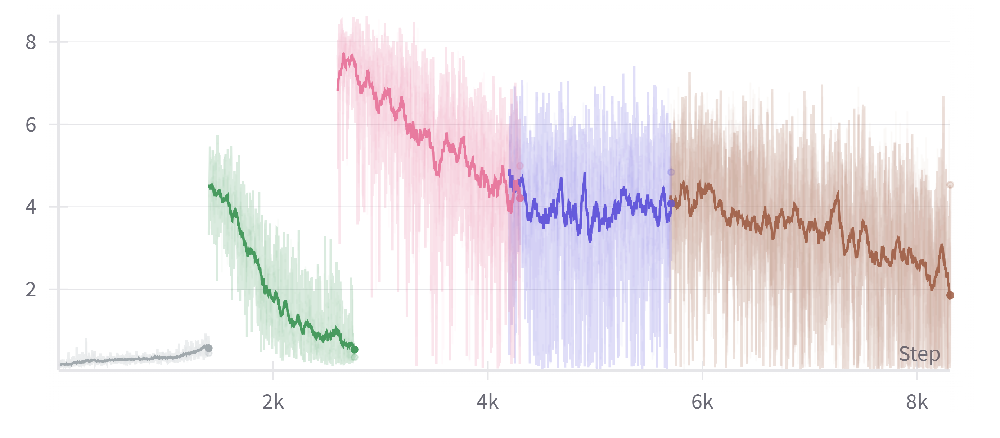
      </figure>
    </td>
  </tr>
</table>

An interesting phenomenon I observed in my experiment is that the average length of the responses did not increase over time; instead, it actually shortened. Upon inspecting the model's outputs, I found that the small model tended to repeat certain phrases, especially in the early stages and even after a period of training. As this issue was mitigated through further training, the resulting improvement manifested as a decrease in overall response length.

However, it's also noticeable that the minimum response length increased with training time, particularly during the first two training phases. This suggests that the model was genuinely improving its ability to "think step-by-step."

I also hypothesize that the difficulty of this dataset may be too low. Once the model became capable of performing Chain of Thought (CoT) autonomously, it no longer required a lengthy thought process or self-reflection to arrive at the correct answer for the majority of the problems.
<table>
  <tr>
    <td align="center">
      <figure>
        <figcaption>Train Length Min </figcaption>
        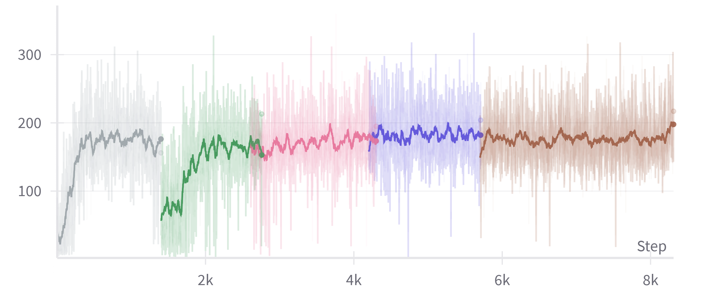
      </figure>
    </td>
    <td align="center">
      <figure>
      <figcaption>Train Length Mean</figcaption>
        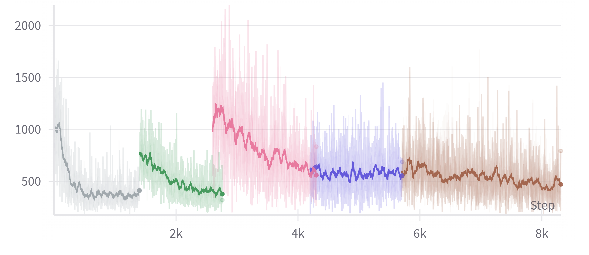
      </figure>
    </td>
  </tr>
  <tr>
    <td align="center">
      <figure>
        <figcaption>Train Response Length Max</figcaption>
        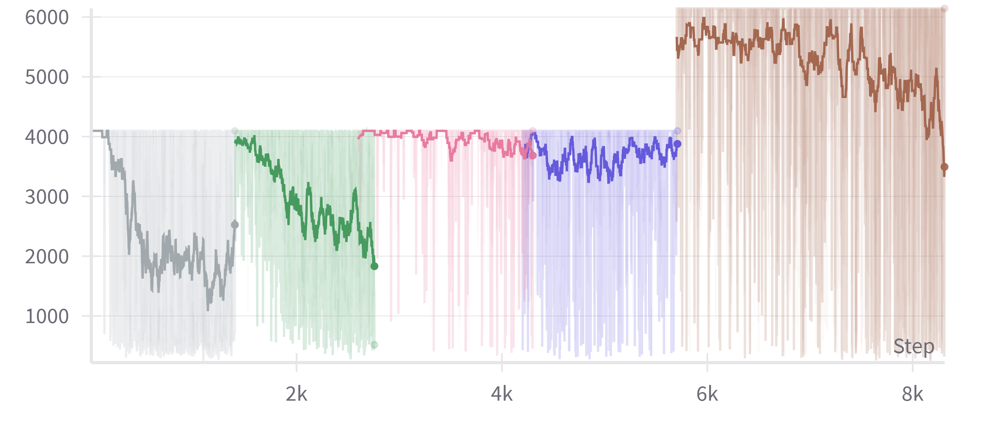
      </figure>
    </td>
    <td align="center">
      <figure>
        <figcaption>Train Response Clip Ratio</figcaption>
        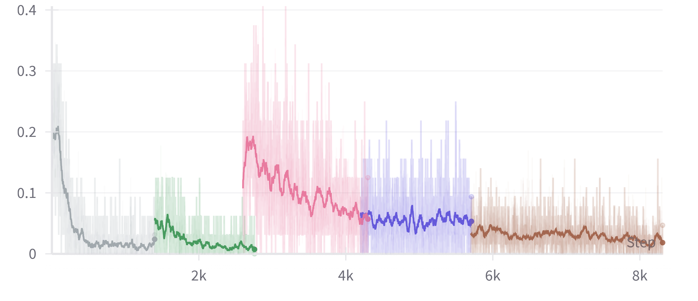
      </figure>
    </td>
  </tr>
</table>

## Performance Check
In the following chart:

* **`step = 0`** represents the base `Qwen/Qwen2-0.5B` model.
* **`step = Instruction`** represents the `Qwen/Qwen2-0.5B-Instruct` model.
* **`step = 2600`** represents the checkpoint saved after the "Reset 1" training phase.
* **`step = 7600`** represents the checkpoint with the highest validation reward, selected after training was concluded.
* During the validation process with different values of `k`, only the largest `k` involves actual inference by the LLM. The values for smaller `k` are estimated by bootstrapping from the results of the largest `k`.

### GSM8K Test Data
In the left figure (1), even before the model had iterated through the entire dataset (at step=2600), its performance on Pass@k, under various k settings, was monotonically better than the results from Instruction Tuning. Furthermore, after extending the training duration, the model's performance still showed significant improvement.

In the distribution shown in the right figure (2), it is also evident that the results after long-term RL training significantly enhanced the model's performance. Extended training and exploration did not increase the model's uncertainty; on the contrary, it markedly reduced the uncertainty of the inference results and significantly increased accuracy, causing the distribution to shift noticeably to the right. The effect was even superior to that of Instruction Tuning.

Based on these experimental results, I personally believe that this training methodology is highly efficient in terms of data utilization and very effective for enhancing model performance under the same data distribution. If the difficulty of the dataset could be gradually increased as the model's capabilities improve, I believe it would provide a substantial boost to both the effectiveness and convergence speed of the model training.

<table>
  <tr>
    <td align="center">
      <figure>
        <figcaption>(1) Pass@K Rate</figcaption>
        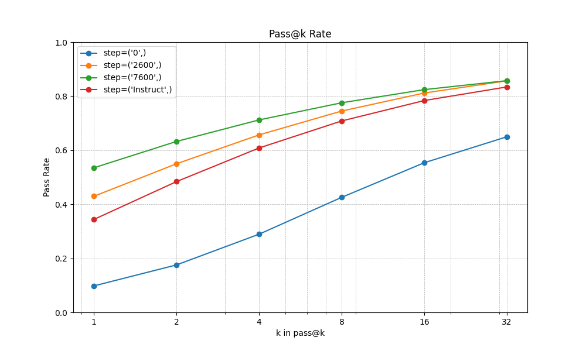
      </figure>
    </td>
    <td align="center">
      <figure>
      <figcaption>(2) Pass@1 Accuracy</figcaption>
        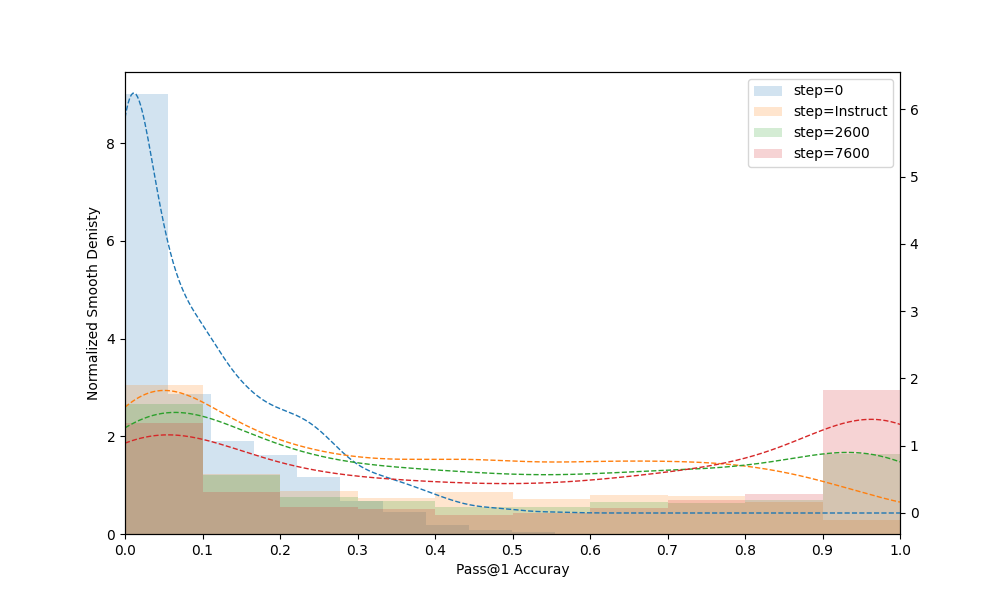
      </figure>
    </td>
  </tr>
</table>

### OOD Test (MATH500)
The reason for selecting the MATH500 dataset is that it encompasses a wide range of difficulty levels (Level 1 to Level 5) and provides detailed definitions for different problem types (e.g., Algebra, Precalculus, Geometry, etc.). This allows for a thorough evaluation of the model's performance on sub-domains not included in the training data, as well as its performance across various difficulty levels.

Before proceeding with the validation, I first used GPT-4.1-mini to annotate all the problems in the GSM8K dataset with their corresponding mathematical sub-domains. It was observed that the majority of the training data falls under Pre-algebra. In contrast, the MATH500 dataset is more evenly distributed across different sub-domains, with a slightly higher concentration in Algebra.

| Domain                 | GSM8K Count | MATH 500 Count |
| :--------------------- | :---------- | :------------- |
| Algebra                | 40          | 124            |
| Counting & Probability | 124         | 38             |
| Geometry               | 61          | 41             |
| Intermediate Algebra   | 3           | 97             |
| Number Theory          | 2           | 62             |
| Prealgebra             | 7240        | 82             |
| Precalculus            | 3           | 56             |

### Overall Performance
The model trained with RL still outperforms the Instruction Tuning Model in both Pass@k and Pass@1 results. The overall decrease in the metric values is, in my opinion, due to the change in problem difficulty (as the relative performance ranking between the models did not change significantly).

This result indicates that after RL training, the model has learned a standard procedure for solving mathematical problems and is capable of generalizing this procedure to solve different types of problems.

<table>
  <tr>
    <td align="center">
      <figure>
        <figcaption>(1) Pass@K Rate</figcaption>
        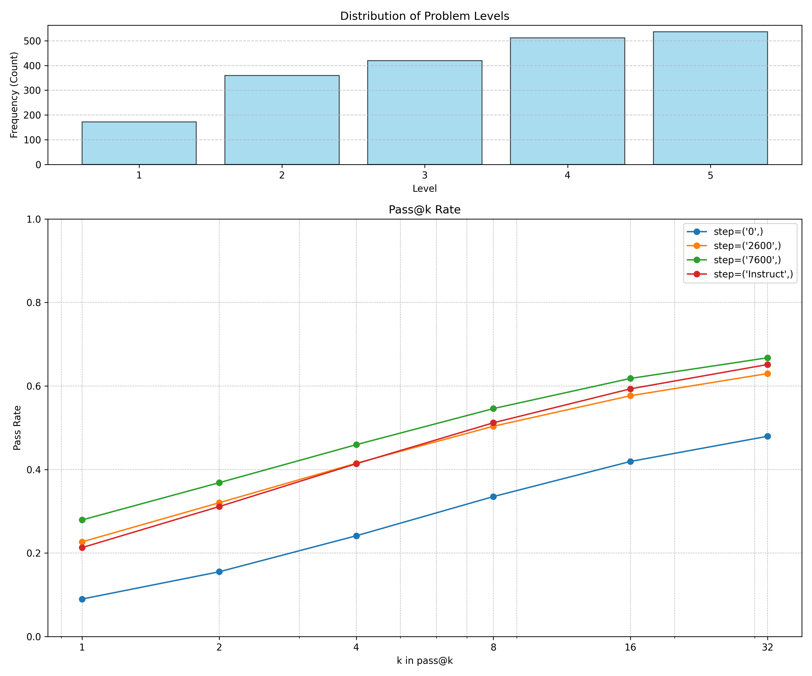
      </figure>
    </td>
    <td align="center">
      <figure>
      <figcaption>(2) Pass@1 Accuracy</figcaption>
        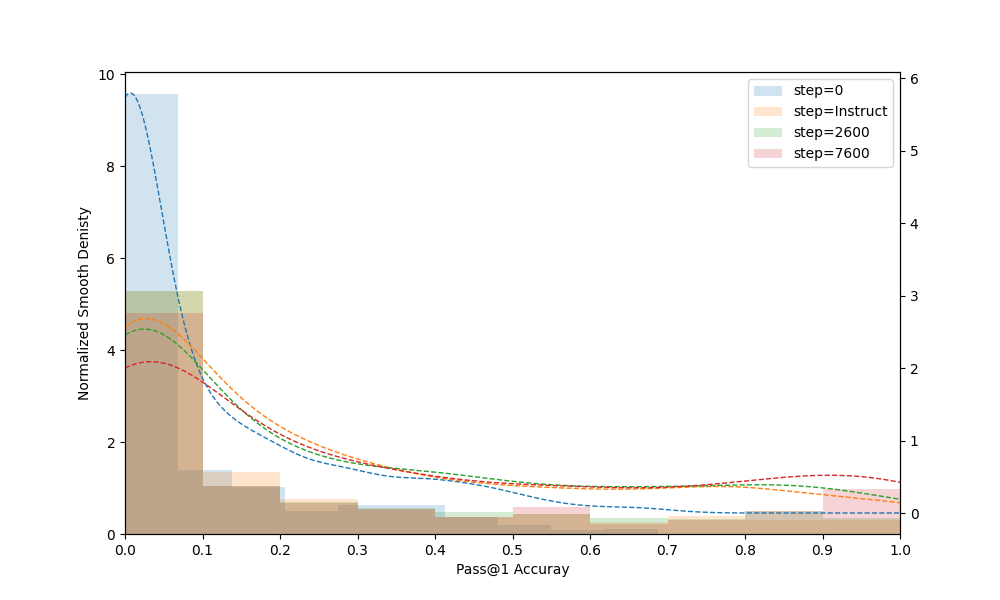
      </figure>
    </td>
  </tr>
</table>

### Different Answer Format
In the GSM8K dataset, some samples (189 of them) have answers in a format different from the typical GSM8K answer style; they might be presented as text, LaTeX syntax, or other forms. This test is designed to verify whether the model overfits to a specific answer format after extensive training—for instance, by only outputting numerical answers. The evaluation is conducted specifically on this subset where the answers are not standard integers.

The relative performance differences between the models are similar to those observed in the overall distribution, although there is a slight decrease in absolute performance. This suggests that the model's core capabilities have not been altered by the different answer formats. It indicates that what the model learned during RL training is a higher-level problem-solving logic, rather than superficially memorizing answers or specific response patterns. I believe the main reason for the performance decline is the different distribution of problem difficulty, as this subset contains a higher proportion of challenging problems (Level 5).

  <table>
    <tr>
      <td align="center">
        <figure>
          <figcaption>(1) Pass@K Rate</figcaption>
          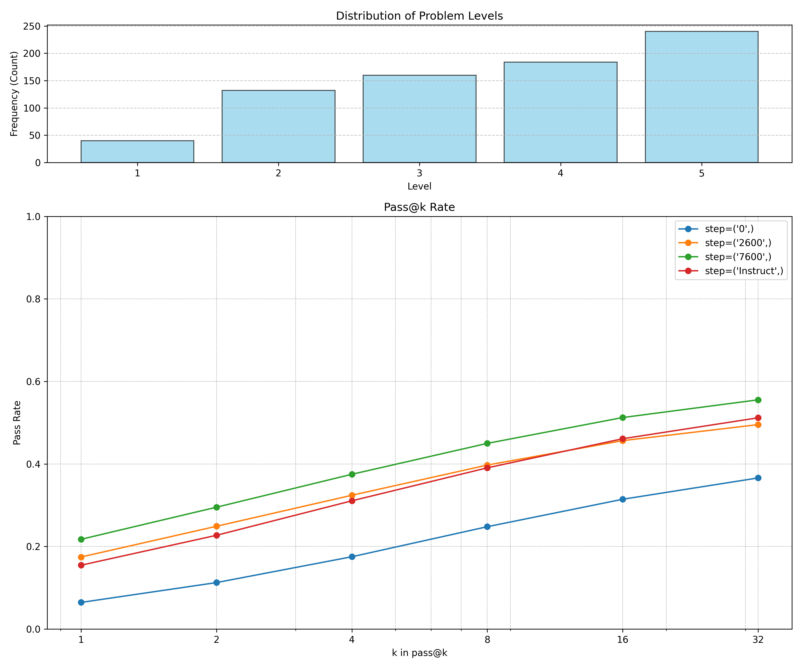
        </figure>
      </td>
    </tr>
  </table>

### Difference Level
In terms of the overall training results, the outcome after extended Reinforcement Learning (RL) training is significantly superior to that of Instruction Tuning in most situations.

The exception is on the simplest level of problems where, as 'k' increases, the Instruction Tuning model occasionally performs slightly better. This situation suggests that for some questions, the instruction-tuned model can arrive at the correct answer, albeit with a very low probability. However, for smaller values of 'k', the RL-trained model still demonstrates better results, indicating that the RL-trained model has a higher probability density of right side in its Pass@1 distribution (a higher per-question correction rate).

Furthermore, when comparing the mid-training checkpoint (step=2600) with the final results, it can be observed that the performance gap between the two is larger on more difficult problems. This indicates that extending the training duration is clearly beneficial.

<table>
  <tr>
    <td align="center">
      <figure>
        <figcaption>(1) Level 1 Pass@K Rate</figcaption>
        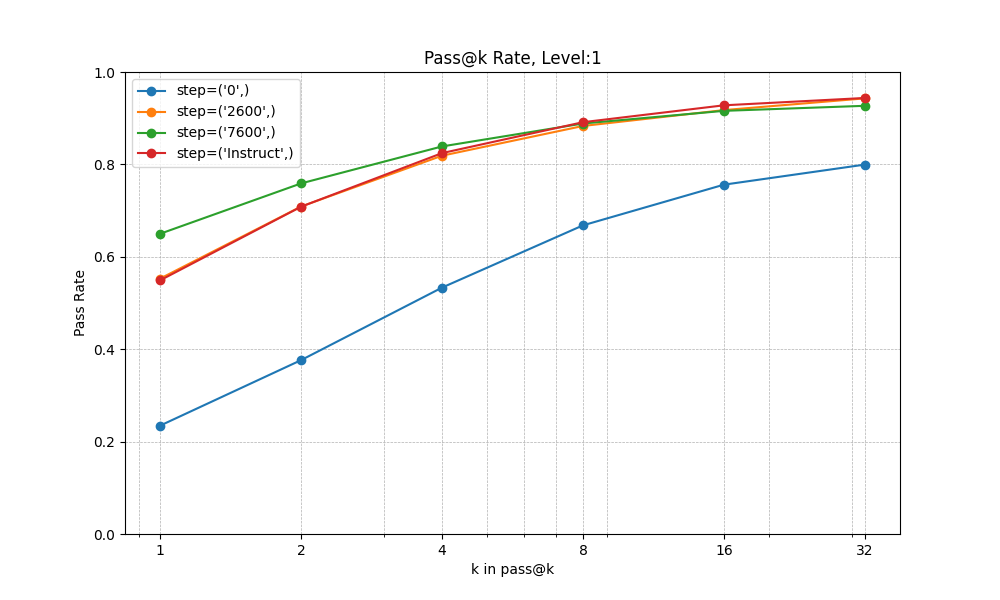
      </figure>
    </td>
    <td align="center">
      <figure>
        <figcaption>(2) Level 2 Pass@K Rate</figcaption>
        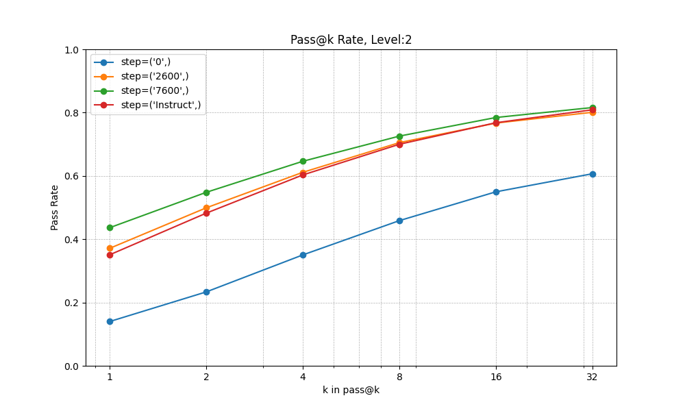
      </figure>
    </td>
  </tr>
  <tr>
    <td align="center">
      <figure>
        <figcaption>(3) Level 3 Rate</figcaption>
        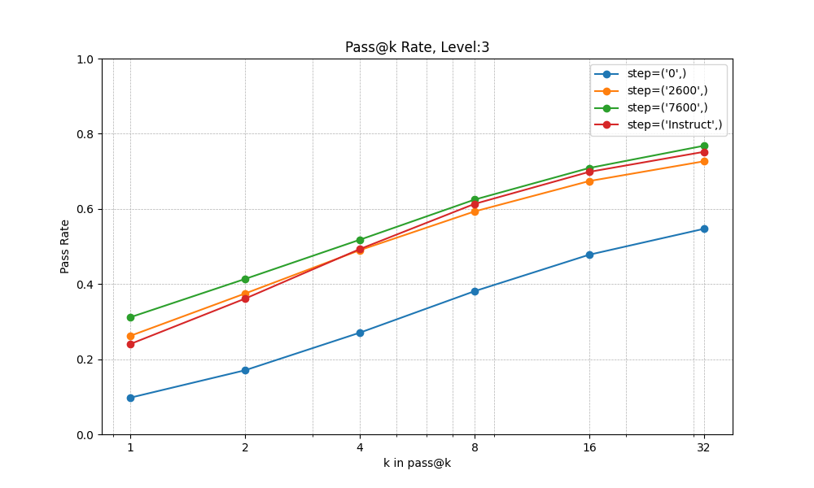
      </figure>
    </td>
    <td align="center">
      <figure>
        <figcaption>(4) Level 4 Pass@K Rate</figcaption>
        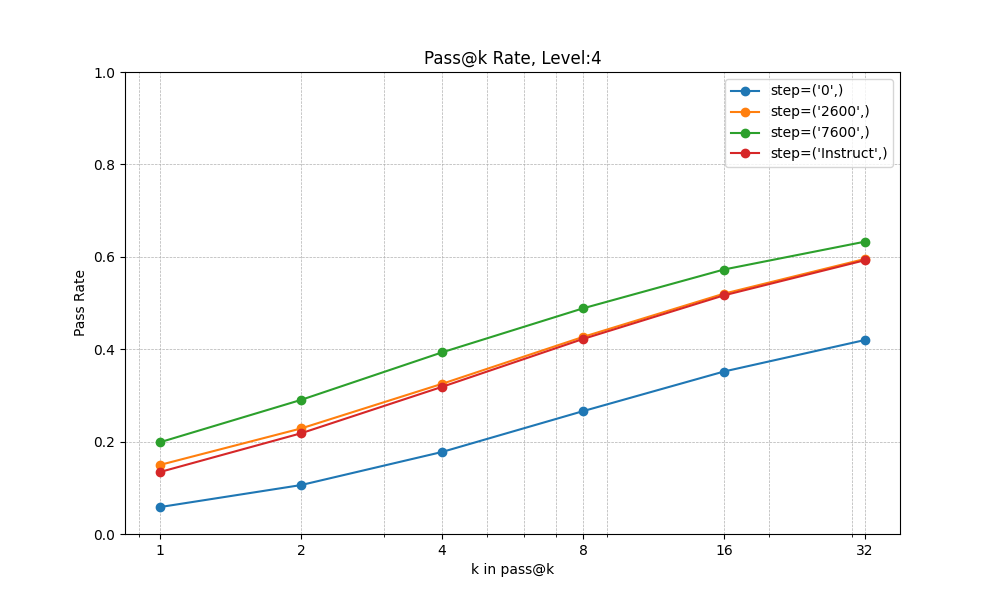
      </figure>
    </td>
  </tr>
  <tr>
  <td align="center">
      <figure>
        <figcaption>(5) Level 5 Pass@K Rate</figcaption>
        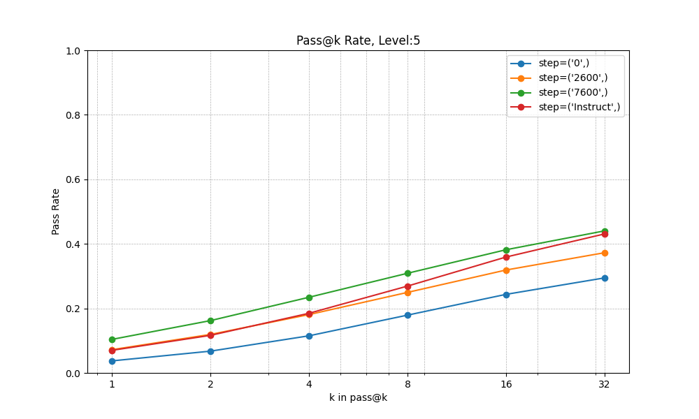
      </figure>
    </td>
  </tr>
</table>

### Question Sub-Domain
In a cross-domain comparison of the same model, it can be observed that the RL-trained model performs relatively better on problems of the Algebra and Pre-algebra types compared to other domains.

A comparison between Algebra and Precalculus reveals that for Precalculus, despite having a relatively simpler difficulty distribution, the Pass@k values are lower than those for Algebra. This suggests that the problem-solving methods learned from the training data may not generalize well to this domain.

This trend is also clearly visible when performing a linear regression on the final model's per-question accuracy at k=32 against the problem domain and level. For domains similar to the training data, such as Algebra and Pre-algebra, the RL-trained model shows larger coefficients. Conversely, domains less represented in the training data—like Intermediate Algebra, Number Theory, and Precalculus—exhibit poorer performance.

| Variable               | Coef    | Std Err | t       | P_val |
| :--------------------- | :------ | :------ | :------ | :---- |
| level                  | -0.1159 | 0.009   | -12.614 | 0.000 |
| Algebra                | 0.8643  | 0.038   | 22.603  | 0.000 |
| Prealgebra             | 0.7815  | 0.042   | 18.638  | 0.000 |
| Geometry               | 0.6182  | 0.053   | 11.772  | 0.000 |
| Counting & Probability | 0.6082  | 0.054   | 11.197  | 0.000 |
| Intermediate Algebra   | 0.5632  | 0.043   | 13.026  | 0.000 |
| Number Theory          | 0.5765  | 0.045   | 12.685  | 0.000 |
| Precalculus            | 0.5118  | 0.046   | 11.023  | 0.000 |

However, a horizontal comparison between different models still reveals that even with less data, the model in RL training shows improvement during the process, even outperforming the Instruction Tuning Model. This suggests that what the model has learned is likely a more general problem-solving approach within the domain of mathematics.

<table>
  <tr>
    <td align="center">
      <figure>
        <figcaption>(1) Prealgebra Pass@K Rate</figcaption>
        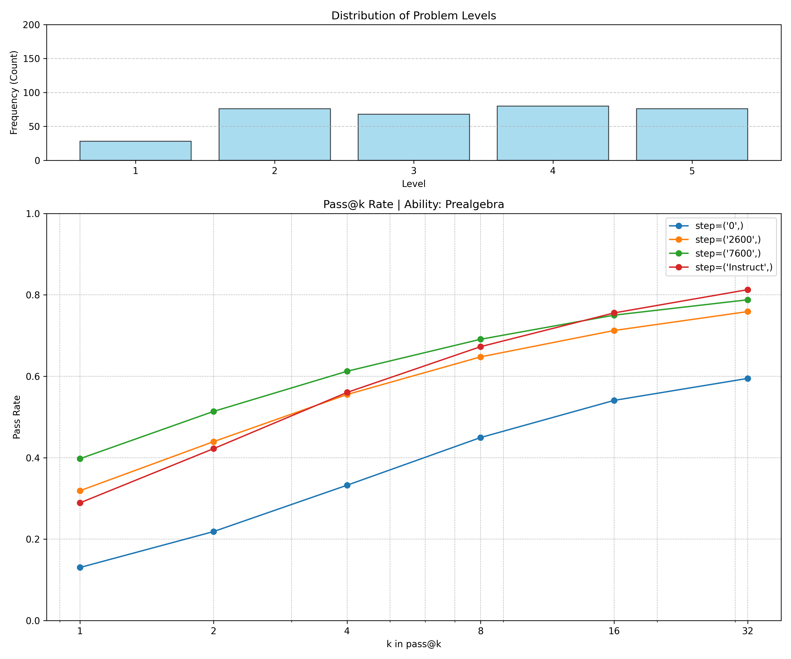
      </figure>
    </td>
    <td align="center">
      <figure>
        <figcaption>(2) Algebra Pass@K Rate</figcaption>
        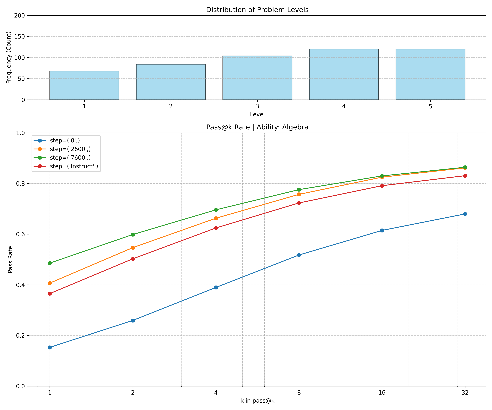
      </figure>
    </td>
    <td align="center">
      <figure>
        <figcaption>(3) Intermediate Algebra Pass@K Rate</figcaption>
        
      </figure>
    </td>
  </tr>
  
  <tr>
    <td align="center">
      <figure>
        <figcaption>(4) Counting & Probability Pass@K Rate</figcaption>
        
      </figure>
    </td>
    <td align="center">
      <figure>
        <figcaption>(5) Geometry Pass@K Rate</figcaption>
        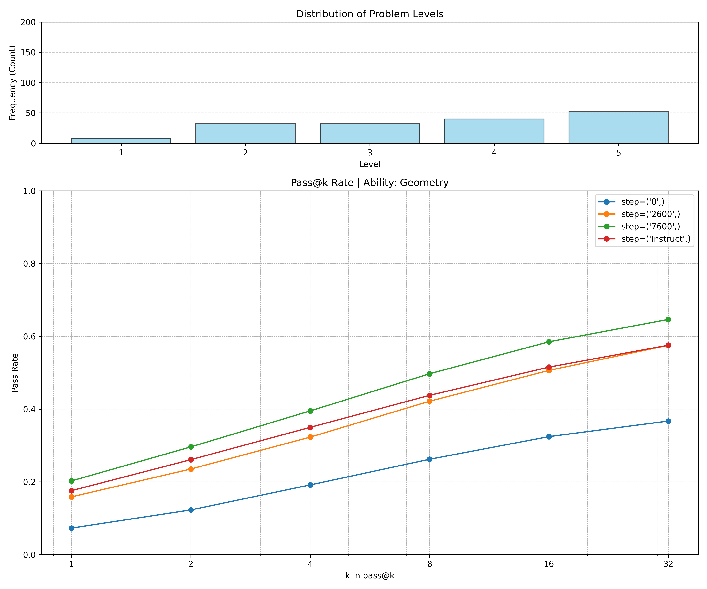
      </figure>
    </td>
    <td align="center">
      <figure>
        <figcaption>(6) Precalculus Pass@K Rate</figcaption>
        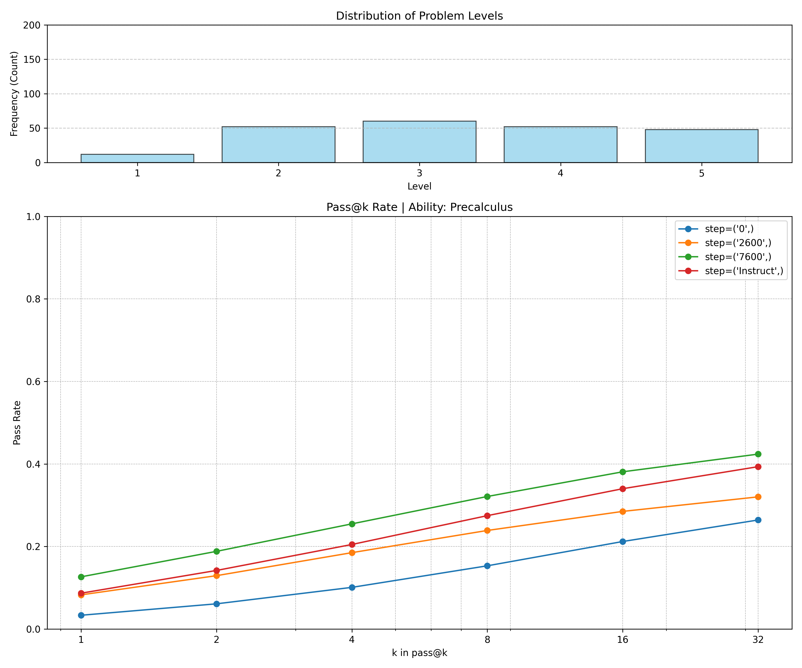
      </figure>
    </td>
  </tr>
  <tr>

  <td align="center">
      <figure>
        <figcaption>(7) Number Theory Pass@K Rate</figcaption>
        
      </figure>
    </td>
  </tr>

</table>

### New Ability
For problems that are consistently answered incorrectly, these questions cannot provide a gradient during the training process (Advantage = 0). Therefore, this part of the experiment is to verify whether the model, after RL training, aligns with and reinforces its own existing patterns, or if it can actually learn new patterns through exploration to answer questions it was previously unable to solve.

In this experiment, 'k' is increased to 128. A problem is defined as being beyond the model's inherent capability if the original model fails to answer it correctly in all 128 responses.

In the two figures below, it can be seen that the model, after RL training, can indeed solve some of the problems it was originally incapable of answering. There is also a change in the Pass@1 Accuracy distribution. Although there isn't a dramatic improvement, the distribution shows a slight tendency to shift to the right.

This indicates that during the RL training process, the model is not merely aligning with specific patterns but is genuinely developing new capabilities to solve problems that were previously unsolvable.
<table>
  <tr>
    <td align="center">
      <figure>
        <figcaption>(1) Pass@K Rate</figcaption>
        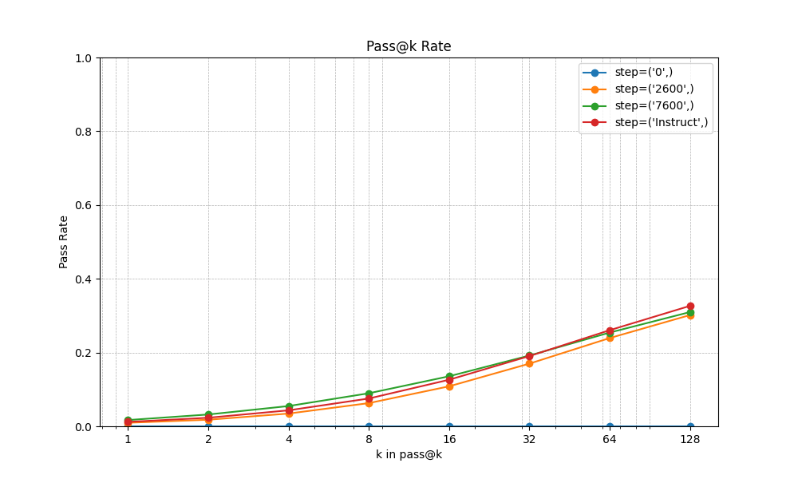
      </figure>
    </td>
    <td align="center">
      <figure>
      <figcaption>(2) Pass@1 Accuracy</figcaption>
        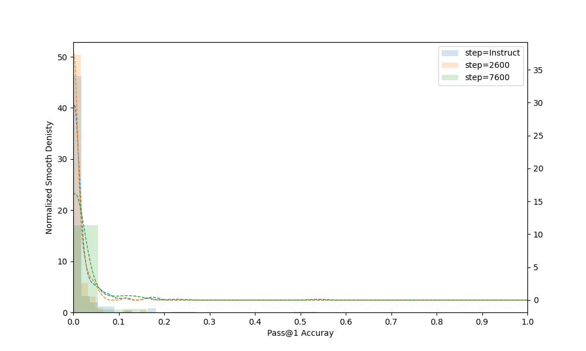
      </figure>
    </td>
  </tr>
</table>

## Summary
* **For smaller models and datasets, Reinforcement Learning (RL) is more effective than Instruction Tuning in the mathematical domain:** On small-scale mathematical reasoning tasks, post-training a small language model (Qwen2-0.5B) with RL leads to performance that surpasses the instruction-tuned model in most scenarios, with some results being on par. This is evident not only in mastering the training data distribution (GSM8K) but also in its generalization ability to the unseen (OOD) MATH500 dataset.

* **RL learns a general problem-solving logic:** The RL-trained model does more than just memorize answer formats or solutions to specific problem types. Experiments show it successfully generalizes the problem-solving procedures learned from a Pre-algebra-dominated training set to other mathematical sub-domains like Algebra and Geometry. It even maintains good performance on problems with non-standard answer formats, indicating that the model has learned a more fundamental and universal problem-solving logic.

* **RL enables the model to learn new skills:** The research confirms that RL training is not limited to reinforcing a model's existing abilities. For problems that the base model was completely unable to solve, after exploration and training with RL, the model can indeed learn new solution methods and successfully answer some of them, demonstrating the potential of RL for capability expansion.

* **Base Model Selection:** For smaller models, selecting the **Base Model** instead of the Instruct Model for RL training yields better results. This is because the base model's higher response diversity facilitates more effective exploration in the initial training stages.

* **Addressing the Cold-Start Problem:** Directly applying parameters from the paper can make small models difficult to train (a cold-start problem). The research found that using a smaller `top_p` value at the beginning of training and gradually relaxing it as training progresses can effectively solve this issue.

* **Hard Reset and LoRA:** As described in the ProRL paper, a 'hard reset' is performed when model performance stagnates. In this training architecture, this involves manually merging the LoRA weights back into the base model and then re-initializing them. This allows the model to learn a larger parameter space compared to using a fixed LoRA module.

* **Response Length Variation:** As the small language model trains, its average response length shortens. This is because the model reduces meaningless, repetitive phrases. Simultaneously, the minimum response length increases, indicating that the model is genuinely learning a 'step-by-step' reasoning process.

* **Importance of Continuous Training:** On more difficult problems, extending the training duration leads to more significant performance improvements, highlighting the value of continuous exploration and learning.

* **Training Data:** The diversity of the training data demonstrably affects the model's performance in specific sub-domains. Therefore, although RL training is less prone to overfitting, data diversity should still be maximized whenever possible to ensure the best training outcomes.

## Directions for Future Improvement
- Incorporate more difficult data.
- Increase the diversity of logical reasoning data, extending beyond just mathematics.
